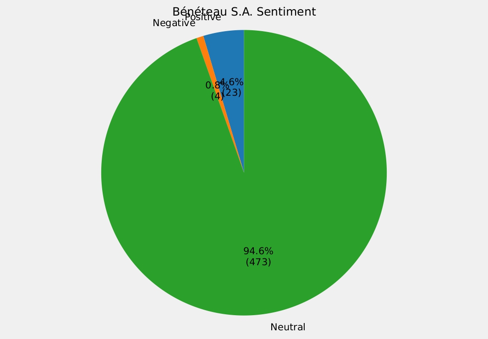
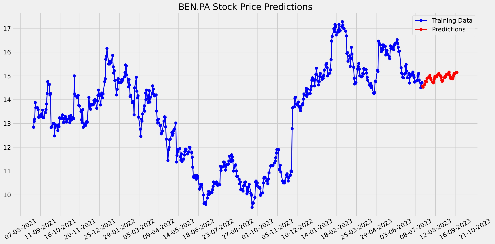
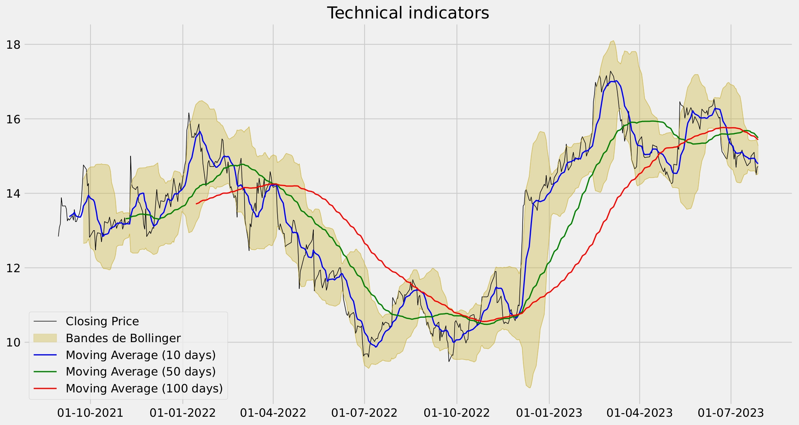

# Market Predictions
## Description
Market Predictions est un programme python capable d'analyser le sentiment du marché, réaliser une analyse selon des critères techniques et des outils mathématiques précis d'une action/cryptomonnaie ainsi que de réaliser une projection du cours selon une période définie à partir de machine learning.

## Installation

Télécharger les fichiers et installer les dépendances.

## Usage

1) Lancer le fichier main.py
2) Remplir le ticker de l'action
3) Indiquer le nombre de jours sur lesquels effectuer l'analyse et entrainer le processus de machine learning
4) Indiquer le nombre de jours à "prédire"
5) Donner son PRU (ROI) 
6) Indiquer le nombre de tweets à analyser en rapport avec l'action
7) Indiquer si c'est une cryptomonnaie ou non
8) Laisser tourner le code !
9) Regarder les résultats dans le dossier "RESULTS PREDICTIONS"

## Exemple de rendu 
### Sentiment du marché

### Prédiction du cours dans la période donnée

### Analyse technique

## Licence

[MIT](https://choosealicense.com/licenses/mit/)
